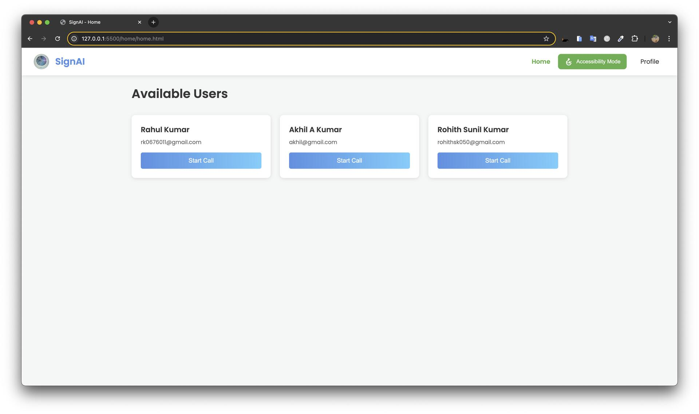
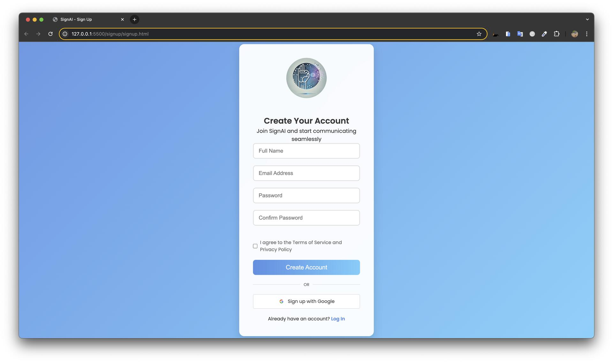

# SignAI 1.0 – Real-Time Sign Language Interpretation

> **Note:** This repository contains the **first stable implementation** of SignAI. Development has continued in **SignAI 2.0**, which introduces improved sign recognition, enhanced AI models, UI/UX improvements, performance optimizations, and additional accessibility features. This repository is maintained as the original version for reference and reproducibility.

---

## 📖 Overview

SignAI 1.0 is an AI-powered real-time communication platform designed to bridge the communication gap between sign language users and non-signers. The application combines real-time video calling with sign language interpretation and text-to-speech conversion, enabling more accessible and inclusive conversations.

The system leverages WebRTC for peer-to-peer video communication, Firebase for authentication and signaling, and a Python-based WebSocket server for real-time sign language inference.

---

## ✨ Features

- 📹 Real-time video calling using WebRTC
- 🤟 AI-powered sign language interpretation
- 🔊 Text-to-Speech (TTS) output
- 🔐 Secure Firebase Authentication
- ⚡ WebSocket-based real-time communication
- ☁️ Easy deployment using Render

---
## 📸 Screenshots

| Homepage |
|-----------|
| 

| Login |
|-------|
| 

---

## 🛠️ Tech Stack

### Frontend
- HTML5
- CSS3
- JavaScript
- WebRTC

### Backend
- Python
- WebSockets

### Authentication & Database
- Firebase Authentication
- Firebase Firestore

### Deployment
- Render

---

## 🚀 Getting Started

### Prerequisites

Before running the project, ensure you have:

- Git
- Node.js and npm
- Python 3.8+
- Firebase project
- Render account (for deployment)

---

## 📥 Installation

### Clone the repository

```bash
git clone https://github.com/Navaneeth-007/SignAI_1.0.git
cd SignAI
```

---

### Install Frontend Dependencies

```bash
npm install
```

---

### Install Backend Dependencies

```bash
pip install -r requirements.txt
```

---

## ▶️ Running the Application

### Start the Frontend

```bash
npm start
```

### Start the WebSocket Server

```bash
python server/websocket_server.py
```

The application will be available at:

```
http://localhost:3000
```

---

# 🔥 Firebase Configuration

Create a Firebase project and replace the configuration inside:

```
call/call.html
```

with your project credentials.

```javascript
const firebaseConfig = {
    apiKey: "YOUR_API_KEY",
    authDomain: "YOUR_AUTH_DOMAIN",
    projectId: "YOUR_PROJECT_ID",
    storageBucket: "YOUR_STORAGE_BUCKET",
    messagingSenderId: "YOUR_MESSAGING_SENDER_ID",
    appId: "YOUR_APP_ID"
};
```

# 🔄 Application Workflow

1. User logs in using Firebase Authentication.
2. A WebRTC peer-to-peer video call is established.
3. Video frames are streamed to the WebSocket server.
4. The AI model processes incoming sign language gestures.
5. Recognized text is returned to the client.
6. The text is converted into speech using Text-to-Speech.
7. Both participants communicate seamlessly in real time.

---

# 📌 Version Information

| Version | Status | Description |
|----------|--------|-------------|
| **SignAI 1.0** | Stable | Initial implementation featuring real-time video calls, sign language interpretation, and text-to-speech. |
| **SignAI 2.0** | Latest | Enhanced AI models, improved recognition accuracy, performance optimizations, refined UI/UX, and additional accessibility features. |

---

# 🚧 Future Improvements

The following enhancements are implemented or being explored in later versions (SignAI 2.0):

- Improved sign recognition accuracy
- Faster real-time inference
- Better UI/UX
- Optimized communication pipeline
- Enhanced model fine-tuning
- Multi-language support
- Additional accessibility features
- Improved scalability

---

# 🤝 Contributing

Contributions are welcome.

1. Fork the repository.
2. Create a feature branch.

```bash
git checkout -b feature-name
```

3. Commit your changes.

```bash
git commit -m "Add new feature"
```

4. Push to GitHub.

```bash
git push origin feature-name
```

5. Open a Pull Request.

---

# 📄 License

This project is licensed under the MIT License.

---

# 👨‍💻 Author

**Navaneeth S**

M.Tech Computer Science (Artificial Intelligence & Machine Learning)

Amrita School of Computing

---

# ⭐ Support

If you found this project useful, consider giving it a ⭐ on GitHub.

For bugs, feature requests, or suggestions, please open an Issue in this repository.
